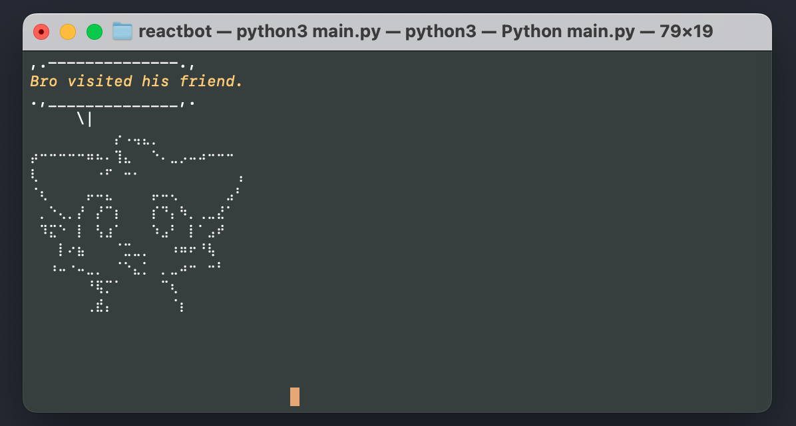

# OrnitReactBot


An automated reaction solution inspired by Jacksfilms' Reactbot.

Are you in a conversation that is either unwanted or incomprehensible to you? Sounds like you could use OrnitReactBot's help.




## How to Use

If you are in need of a reaction, run the `main.py` script
```sh
python3 main.py
```
Once the program started, press enter every time you want the bot to react. It will carefully pick out a sentence and speak it out loud. (Must be connected to the internet to use GTTS)

## Installation

Clone the repository and install the requirements. You must have Python and Git installed.

```sh
git clone https://github.com/OrnitOnGithub/OrnitReactBot
cd OrnitReactBot
pip3 install -r requirements.txt
```

## Contributors

[](https://github.com/OrnitOnGithub/OrnitReactBot/graphs/contributors)

 


## Contribute

Any help is appreciated when it comes to reaction sentences. `phrases.txt` is meant to be a somewhat comprehensive list of gen-Z slang, however there is always room for expansion, and phrase suggestions are always welcome.


